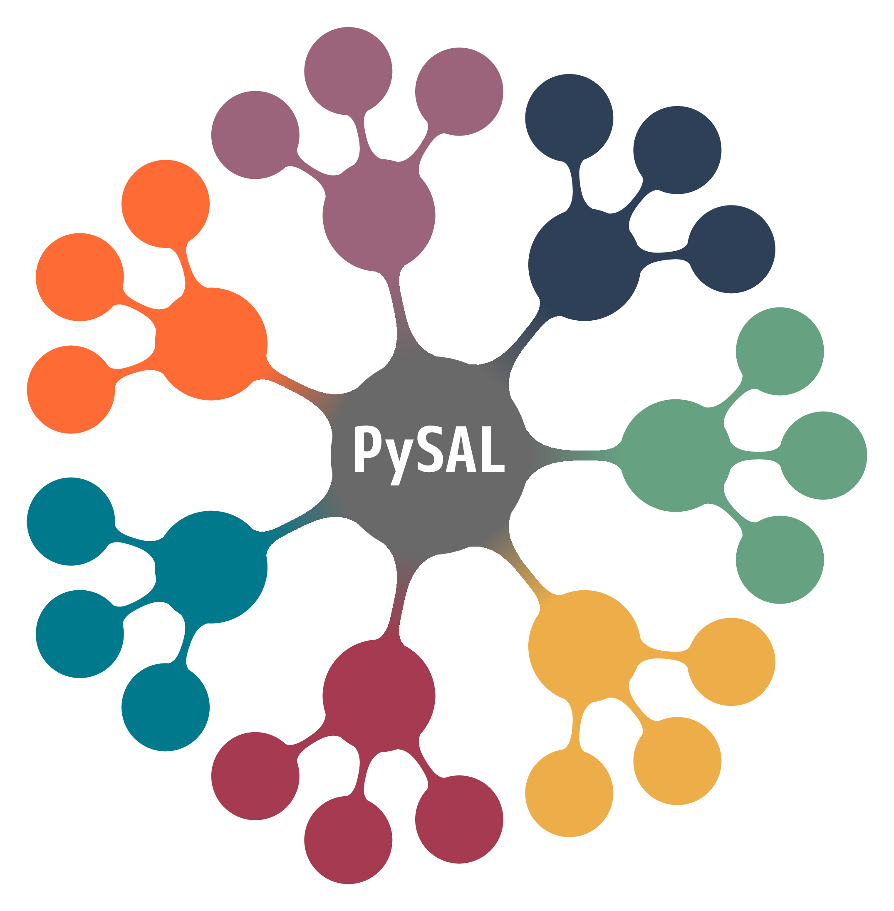

# Spatial Data Science with Python

[](https://codespaces.new/sjsrey/workshop-pysal-sew24)

[](https://mybinder.org/v2/gh/sjsrey/workshop-pysal-sew24/main?urlpath=lab)


<p align="center">

</p>

### Instructor

* Serge Rey - San Diego State University

---

## Topics

* spatial weights
* choropleth mapping
* global spatial autocorrelation
* local spatial autocorrelation
* spatial regression
* spatial feature engineering


## Getting Started

There are three options for obtaining and working with the workshop materials:

1. Binder (cloud-emphemeral)
2. Codespaces (cloud)
3. Local Installation (local install)


### Binder
__To get started immediately without installing or downloading anything, click [](https://mybinder.org/v2/gh/sjsrey/workshop-pysal-sew24/main?urlpath=lab)__

This will open up a virtual machine that has all the code and data
preinstalled. It will take 10-15 minutes to build the virtual machine but, once
it is built, you will be able to interact with the course materials.

It is important to note that the binder virtual machine is ephemeral. This means
you will not be able to save your work.


### Codespaces
If you do not want to install anything on your local machine, but do want to
save your work in the cloud, then this option is the one you want.

You do need to have a [github account](http://github.com).

To create a codespace on your github account, click the following link

[](https://codespaces.new/sjsrey/workshop-pysal-sew24)

This will start building a codespace under your github account. This will take
10-15 minutes to build and start.

Once it starts, you will be able to work interactively with the workshop
materials, and save your work so that you may return after shutting the
codespace down.

### Local Install

If you are familiar with GitHub, you should clone or fork this GitHub repository to a specific directory. Cloning can be done by:

```bash
git clone https://github.com/sjsrey/workshop-pysal-sew24.git
```

If you are not using git, you can grab the workshop materials as a [zip file](https://github.com/sjsrey/workshop-pysal-sew24/archive/refs/heads/main.zip). Extract the downloaded zip file to a working directory.

See the [installation instructions](docs/installation.md) for more information on getting a python environment setup
